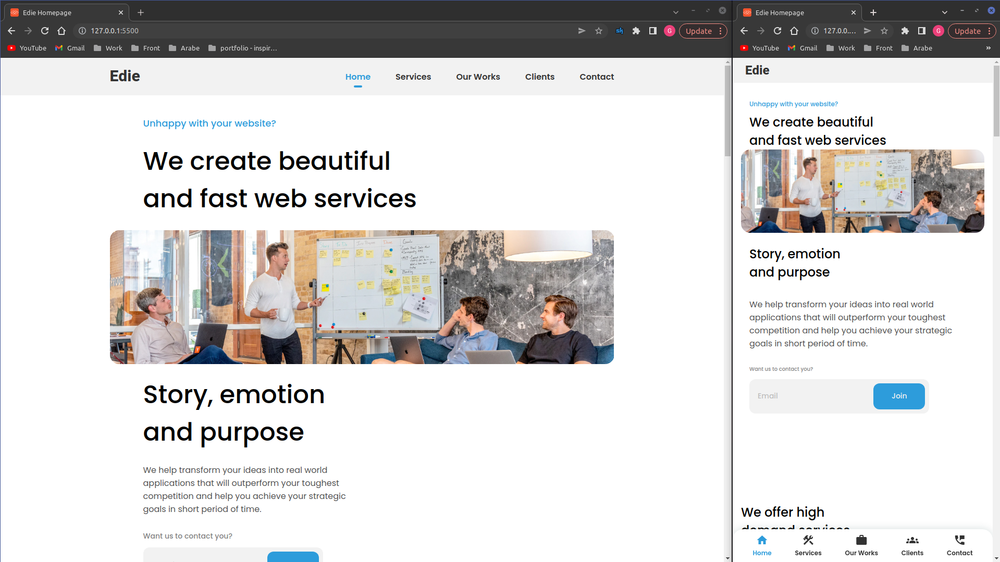

<!-- Please update value in the {}  -->

<h1 align="center">Edie Homepage</h1>

<div align="center">
   Solution for a challenge from  <a href="http://devchallenges.io" target="_blank">Devchallenges.io</a>.
</div>

<div align="center">
  <h3>
    <a href="https://edie-homepage-ge.netlify.app/">
      Demo
    </a>
    <span> | </span>
    <a href="https://github.com/ghizlane-elatmani/Edie-homepage">
      Solution
    </a>
    <span> | </span>
    <a href="https://devchallenges.io/challenges/xobQBuf8zWWmiYMIAZe0">
      Challenge
    </a>
  </h3>
</div>

<!-- TABLE OF CONTENTS -->

## Table of Contents

- [Overview](#overview)
  - [Built With](#built-with)
- [Features](#features)
- [How to use](#how-to-use)
- [Contact](#contact)
- [Acknowledgements](#acknowledgements)

<!-- OVERVIEW -->

## Overview



- You can see my demo here: "https://edie-homepage-ge.netlify.app/"
- With this project, I learn how to setup a bottom navigation.
- I hope to make more beautifuls websites and become an expert in front-end developmemt :)

### Built With

- [HTML](https://developer.mozilla.org/fr/docs/Web/HTML)
- [CSS](https://developer.mozilla.org/fr/docs/Web/CSS)
- [Javascript](https://developer.mozilla.org/fr/docs/Learn/JavaScript)

## Features

This application/site was created as a submission to a [DevChallenges](https://devchallenges.io/challenges) challenge. The [challenge](https://devchallenges.io/challenges/xobQBuf8zWWmiYMIAZe0) was to build an application to complete the given user stories.

- [x] User story: I can see a page following the given design
- [x] User story: I can see a page on mobile following the given design
- [x] User story: I can go to certain locations by selecting links in navigation or footer
- [x] User story (optional): Surprise me with mobile navigation.

## How To Use

<!-- Example: -->

To clone and run this application, you'll need [Git](https://git-scm.com) and [Node.js](https://nodejs.org/en/download/) (which comes with [npm](http://npmjs.com)) installed on your computer. From your command line:

```bash
# Clone this repository
$ git clone https://github.com/ghizlane-elatmani/Edie-homepage

# Install dependencies
$ npm install

# Run the app
$ npm start
```

## Acknowledgements

- [Material Design Icons](https://google.github.io/material-design-icons/)

## Contact

- Website [edie-homepage-ge.netlify.app](https://edie-homepage-ge.netlify.app/)
- GitHub [@ghizlane-elatmani](https://github.com/ghizlane-elatmani)
